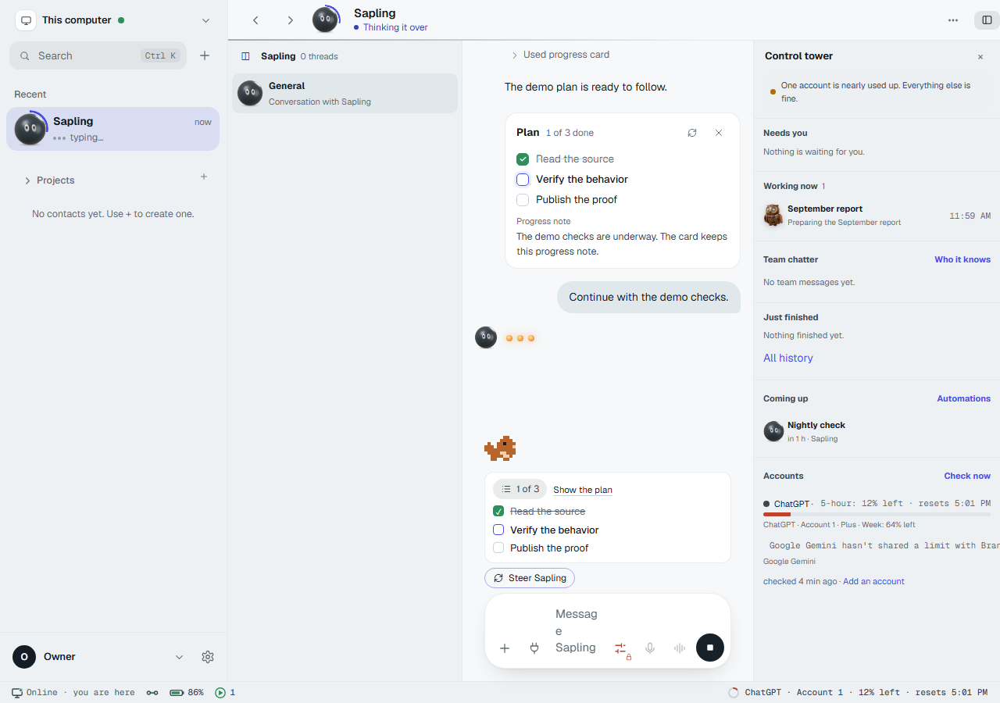
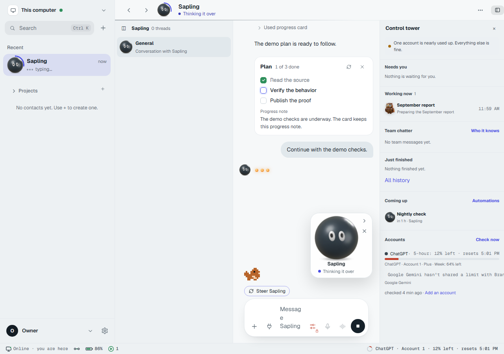
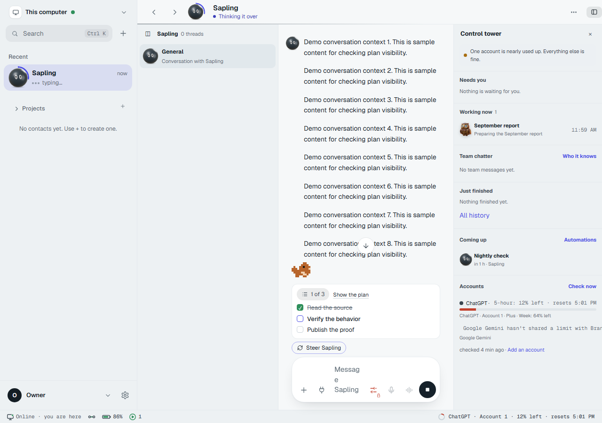

# plan-tracker-once

Work branch: `trunk/plan-tracker-once`. PR pending Coordinator. No PR was opened and nothing was merged.

## What and why

The live card now registers its actual element in a session-keyed store. The dock subscribes to that registration, stays hidden until a real card is registered, and appears only when that card is out of view. Remounts disconnect the old observer and register the new node. Dismissal removes the registration. Completed plans never show a tracker. Both tracker links scroll the registered card; the stand-in retires synchronously before jump navigation can paint both views.

Card text, progress note, Refresh, Dismiss, Done pill and time remain unchanged. No CSS, restricted files, gate scripts, workflows, manifests or lockfiles changed. The CI batch lists both added/changed test files. The existing note-only component tests now supply an IntersectionObserver fixture.

## Checks

- From `window/`: `npx vitest run src/composer/plan-once.test.tsx src/thread/PlanCard.note-only.test.tsx src/thread/PlanCard.test.ts` — **22 passed, 3 files passed**.
- From `window/`: `pnpm typecheck` — **passed** (invoked equivalently as `pnpm -C window typecheck`).
- From repository root: `node scripts/check-window-clean.mjs` — **passed, no new violations**. The baseline was not edited.
- `git diff --check` — **passed**.
- Built before/after demo fixtures with `pnpm -C window exec vite build --config proof-vite-local.ts`. The fixture configuration was temporary and is not part of the work commit.

## Visual proof

These are built WindowShell demo fixtures, not a model-backed run or a real account. Progress updates, the long reply and conversation changes are seeded fixture events; Show the plan, the folded count and Settings controls are actual UI clicks. Chromium used reduced motion. A separately isolated scratch gateway reached HTTP 200 readiness; the fixture itself uses demo requests rather than that gateway. Its existing engine build was reused; no engine source/build changed.

The baseline uses current-main DockRow with the same demo content and reproduces the stale observer after the card moves to its anchoring turn.

[Recorded click-through](click-through.mp4) · [All captured frames, in order](contact-sheet.png) · [Frame telemetry](frame-audit.json)

| Key frame | Result |
| --- | --- |
| Start | Card, note and controls; no tracker. |
| Scroll away | Card offscreen; open tracker, 1 of 3 and three steps. |
| Show the plan | Card returns; tracker gone. |
| Complete a step | Card reads 2 of 3; no tracker. |
| Long reply | Card offscreen; tracker reads 2 of 3. |
| Switch away and back | Alternate demo conversation has no plan; original tracker returns correctly. |
| Finish | No tracker; card shows Done and recorded time. |
| Settings | General, Advanced, Task progress starts: Folded selected through the UI. |
| Scroll away again | Count-only 1 of 3 chip. |
| Click folded count | Card returns; tracker gone. |

### Frame criterion caveat

All 46 captured frames were inspected in order; none shows two plan views. All nine key conversation frames show exactly one. All 464 animation-frame telemetry samples also have at most one view. There are 109 zero-view samples, including Settings, the alternate conversation, and brief scroll/observer handoffs. Therefore this demonstrates the preview's **never-two / at-most-one** behavior, but does **not** claim the brief's literal exactly-one-in-every-transition-frame condition. Coordinator clarification is pending on that distinction. The audit uses the specified 0.2 visibility threshold and counts the nested count button as part of its expanded tracker, not an extra view.

## Cleanup

Scratch gateway PID 59136 and preview PIDs 33628 and 60512 were stopped by PID. The earlier gateway PID 29380 refused startup before readiness and exited; it did not migrate shared state. Playwright closed its headless Chromium instances; no matching scratch Chromium processes remained. No running desktop app was used.

Final head baf70abd729013d0534967ebf51da5227eccfd5d
