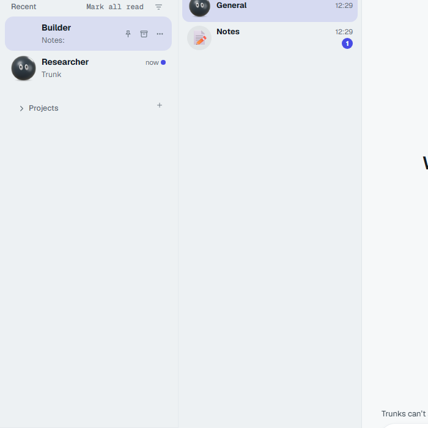
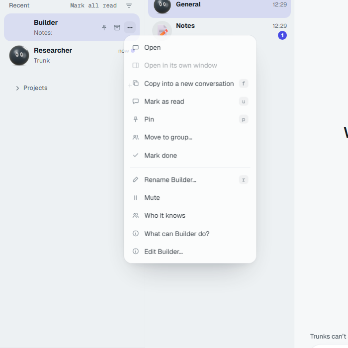
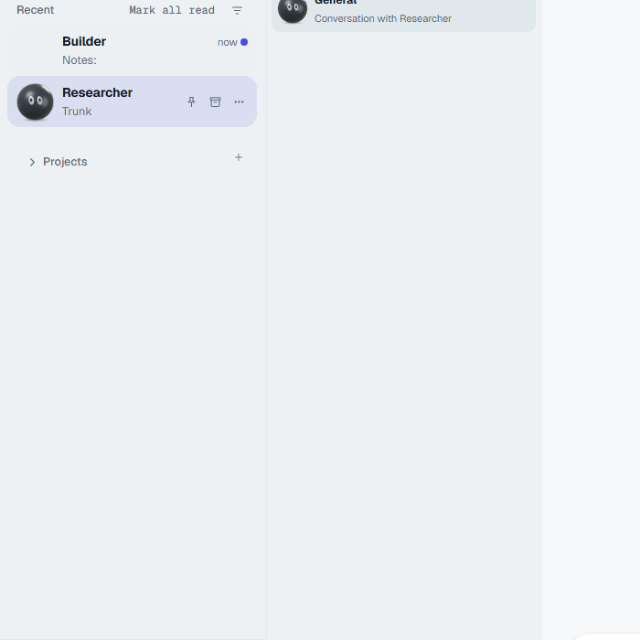

# Recent sidebar rows: #774 follow-up

The original #774 changes are ported onto main at `cfe152a2dc6554a4118f090a25d20427cc6eff17`, which includes #767 and #824. Main's conversation-opening changes remain intact. The button-crawl baseline differs only by removal of `sidebar :: Builder` and `sidebar :: Researcher`.

## Checks

| Command | Result |
| --- | --- |
| `node scripts/install-worktree.mjs both` | Passed; frozen lockfiles, hardlinked dependencies |
| `pnpm -C engine/packages/gateway-protocol run build` | Passed |
| `pnpm -C engine/packages/gateway-client run build` | Passed |
| `pnpm -C window exec playwright install chromium` | Passed |
| `node --test scripts/button-crawl/crawl.test.mjs` | 8 passed |
| `pnpm -C window exec vitest run src/shell/sidebar-row.test.tsx -t 'recent row\|opening a row\|hover card\|selected row\|thread header'` | 10 passed, none skipped |
| `pnpm -C window typecheck` | Passed |
| `pnpm -C window exec vite build` | Passed |
| `BUTTON_CRAWL_URL=http://127.0.0.1:5653 BUTTON_CRAWL_PORT=5653 node scripts/button-crawl/crawl.mjs` | Exit 0; 41 screens, 752 controls, no new or stale problems |

The final crawl used Linux Node and Playwright Chromium 1.63.0, matching the workflow's browser platform, against the same isolated Vite harness. The Vite server was started with `node node_modules/vite/bin/vite.js --host 127.0.0.1 --port 5653 --strictPort` from `window/`. No crawl limits, baseline entries other than the two requested, or crawl code were changed. The [gate summary](sidebar-rows-v2-crawl.json) records the result.

Earlier native Windows attempts hit `spawn pnpm ENOENT`, a page-reload observation race, and an unrelated stale voice-note entry. The final Linux run completed cleanly without baseline changes for those failures.

## Live scratch check

The built window ran against an isolated scratch gateway on port 19651, with its own home, state, config, token, and two test Trunks. Vite preview used port 5651. No live app data or listeners were used.

Clicked Builder, then More, then Researcher. Both opens retained the full sidebar, including when Builder had a Notes thread. Both rows exposed Pin, Archive, and More. Builder's Archive was disabled with `The main conversation can’t be archived.`; Researcher's Archive was enabled. Builder's More menu opened normally.

The row menu follows the existing `pop-rowmenu-light.png` design artifact's menu pattern. The preserved [original before/after proof](sidebar-rows-before-after.png) shows the other #774 improvements. Screenshots below are cropped to the changed sidebar and thread pane, excluding machine identity and credentials.

Cleanup verified: crawl server PID 12148, scratch gateway launcher PID 9488 and runtime PID 24664, preview PID 64368, and the Playwright browser exited. No listeners remained on 19651, 5651, or 5653.

PR pending Coordinator: `fix(window): recent rows share the same sidebar actions (supersedes #774)`. No PR was opened or merged.
