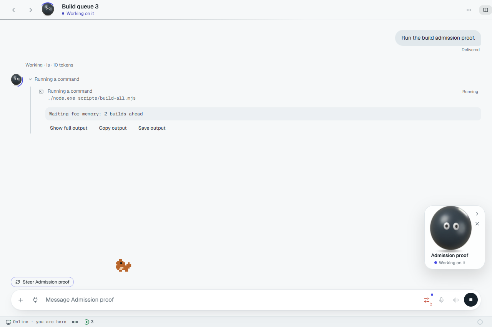
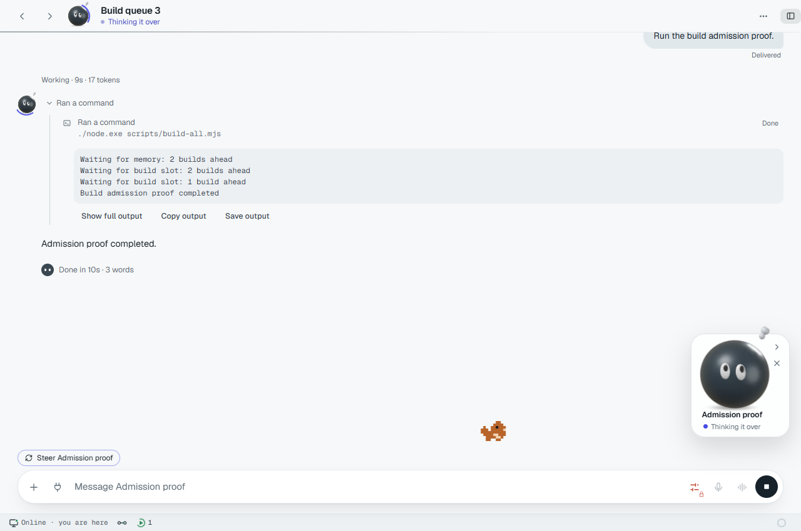

# Host heavy-step admission proof

## Candidate and isolation

The source gateway at code head `b4db736221940adfb4e95b835b823637cfcce00a`
was connected to the candidate window in a headless browser. The gateway used
fresh state, configuration and workspace directories and unused loopback ports.
An independent local mock provider supplied deterministic tool calls; no paid
model endpoint or installed application was used.

This is a controlled low-memory admission test, not a claim that the computer
was genuinely out of memory. The free-memory probe initially returned 1024 bytes
and the build setting required 8 MiB. Releasing the probe restored the actual
free-memory reading. The fixture's Windows environment retained `PATHEXT`, and
an independent shell preflight verified executable invocation before the test.

## Observations

Three independent runs requested the same classified build command:

```text
./node.exe scripts/build-all.mjs
```

- All three waited before executing their build bodies.
- The third run rendered `Waiting for memory: 2 builds ahead` in the window.
- A separate chat completed successfully while all three builds were waiting.
- After memory was released, all three runs resumed without another user turn.
- Three exact command-completion events reported exit code 0, and three separate
  build-body completion records were written. The window rendered the command
  output and completion.
- The browser and every launched gateway, window and mock-server process tree
  were stopped. The exact launched process IDs were checked after cleanup.

The existing shared ownership implementation also serializes the build slot;
the completion screenshot shows the queue advancing from two builds ahead to
one before the third build executes.

### Waiting



### Automatically resumed



## Functional regression coverage

The named engine regressions cover build-launcher admission, managed-exec
waiting and light-exec bypass, and native command-hook waiting. Restoring their
production entrypoints to the main proof snapshot makes each acceptance test
fail functionally. Additional tests cover owner custody, cancellation, Windows
owner-file deletion races and same-millisecond queue ordering.

See [exec memory admission settings](./exec.md) for configurable memory needs.
