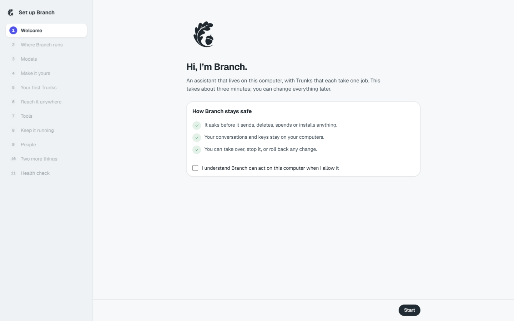
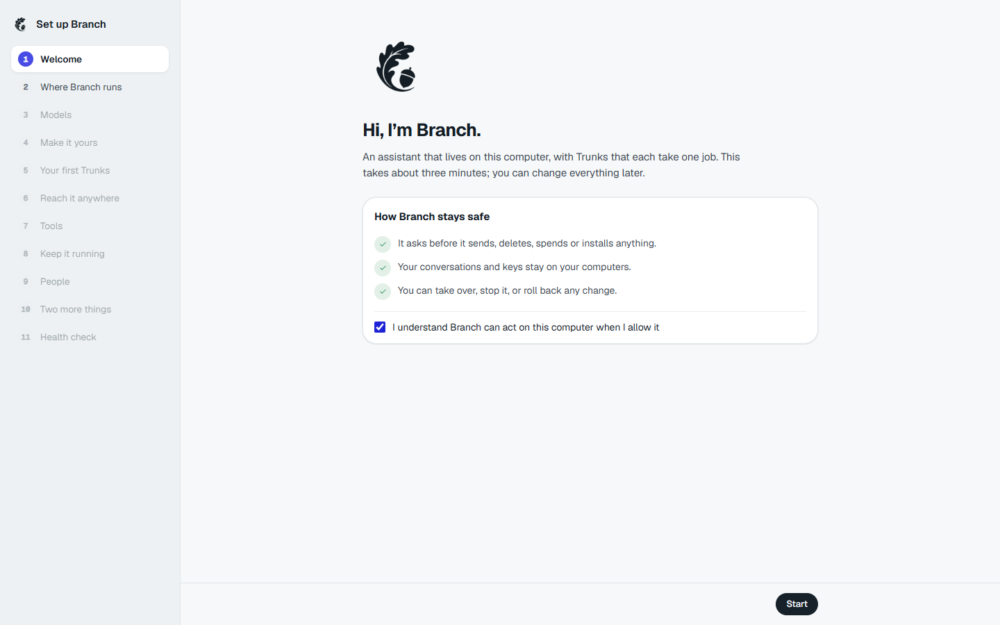
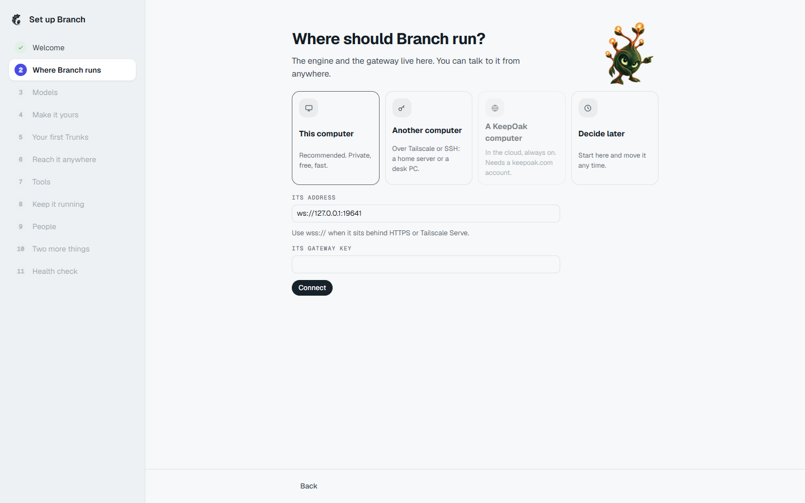
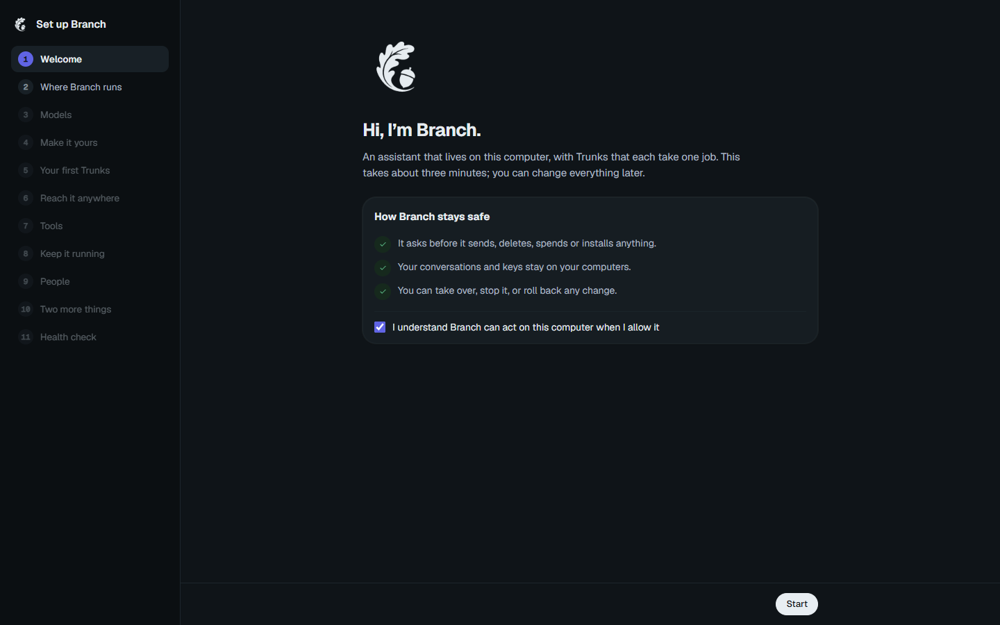

# Welcome safety promise rebuild — supersedes #770

Product branch: `trunk/770-welcome-safety-promise`

Final product head: `a548b18bd2b3c12e8c7d401011d19657739f09cd`

Fresh base: `d47e97551d8a278f067d5e4a827c503303c5dd8d` (main after #673).
Old #770 tip was used as reference only; it was not merged or continued.

## What and why

Bring forward #770's token-based Welcome safety card and smaller text-colour acorn without a tile. Keep main's three safety promises and checkbox-gated Start, and cover the gate being revoked by unticking. Preserve #673's Setup order, passed-step ticks, poses and shared job tile colours: SetupFlow.tsx and setup-model.ts are unchanged. The window-clean baseline is unchanged.

## Fresh proof

Built window on loopback port 5641 with a scratch-only gateway on 19641 and separate home/state/config under the system temporary directory. The unchanged prebuilt Birch engine and package dist were copied into the fresh worktree for scratch use only; no engine build or engine source changes.

The recorded flow uses the real fresh pre-connect screens, with the scratch gateway address and no pre-supplied key. Load → tick the promise → Start → Where → select This computer. Assertions verify exact safety lines, full #673 rail order, Start disabled before acknowledgment, later rail steps disabled, Start enabled afterward, and only Welcome ticked on Where. A dark Welcome screenshot follows. Scratch gateway health probe returned HTTP 200.

Compared with `docs/design/screens/ob-welcome-light.png` and the requested #770 changes: safety wording, rail order and gate agree; the hero intentionally uses the approved acorn instead of the earlier mascot, in the surrounding text colour without a tile. Light and dark screenshot inspection confirms this.









[Recorded click-through](welcome-clickthrough.webm)

## Exact verification

From `window/`:

```text
pnpm exec vitest run src/setup/welcome.test.tsx src/brand/KeeperMark.test.tsx src/setup/setup-preview.test.tsx src/setup/setup.test.tsx src/setup/talk-setup.test.ts src/places/settings/set2/developer.test.tsx
```

6 files passed, 70 tests passed. Includes all four #673 named test files, Welcome and KeeperMark. The first run needed the gateway-client package built; the final run passed all six files.

From the repository root:

```text
pnpm -C window typecheck
pnpm -C window exec vite build
node scripts/check-window-clean.mjs
git diff --check
```

All passed. The initial type-check hit a changed hardlinked compiler input; rerunning passed without source changes.

Browser verification:

```text
node %TEMP%/branch-770-clickthrough.cjs
```

Real Playwright clicks and screenshots, with recording; assertions passed. Chrome closed by Playwright. Scratch gateway PID 35652 and window preview PID 30404 stopped by PID. Failed initial scratch startup PIDs 44244 and 45468 had already exited.

## Handoff

PR pending Coordinator (supersedes #770). No PR opened, no merge, no force-push, no amendment or rebase of published commits.
